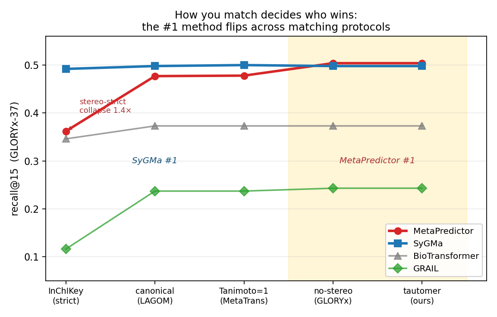

# GLORYx-37 results — match-sensitivity on the literature shared set

The GLORYx external set (37 drugs; reference metabolites as a per-generation tree, flattened
to all generations — 205 entries, ~136 unique by InChIKey) is the field's de-facto shared
hold-out. We score every method's *fixed* predictions under all five matching protocols
(`scripts/eval_on_gloryx.py`; data `docs/benchmark/data/gloryx_test.json`, escapes fixed on
load). GRAIL = full5000_priors checkpoint at val-selected `prior_strength=8`, top-15.

## Recall@15 by matching protocol (4 methods run under one protocol)

| method | canonical (LAGOM) | InChIKey (strict) | no-stereo (GLORYx) | Tanimoto=1 (MetaTrans) | tautomer-InChIKey (ours) |
|---|---|---|---|---|---|
| SyGMa | 0.498 | **0.492** | 0.498 | 0.500 | 0.498 |
| MetaPredictor | 0.477 | **0.362** | **0.504** | 0.478 | **0.504** |
| BioTransformer | 0.373 | 0.346 | 0.373 | 0.373 | 0.373 |
| GRAIL | 0.237 | **0.116** | 0.243 | 0.237 | 0.243 |

recall@k (tautomer): MetaPredictor 0.244/0.477/0.501/0.504 · SyGMa 0.347/0.461/0.483/0.498
· BioTransformer 0.175/0.297/0.336/0.373 · GRAIL 0.182/0.219/0.228/0.243 (@5/10/12/15).

*Figure (`rankflip.png`, via `scripts/make_rankflip_figure.py`): recall@15 across the five
matching protocols, strict→lenient. SyGMa is flat (~0.49–0.50, stereo-robust); MetaPredictor
starts below it under strict InChIKey (stereo collapse 1.4×) and overtakes it under the
stereo-blind protocols — the shaded "MetaPredictor #1" region.*

**A genuine top-of-leaderboard rank-flip — from the match protocol alone.** With two close
methods (SyGMa and MetaPredictor) the *identity of the #1 method changes with the matching
rule*: SyGMa is first under `canonical` (0.498 vs 0.477), strict `inchikey` (0.492 vs 0.362),
and `tanimoto1` (0.500 vs 0.478); MetaPredictor is first under `inchi_no_stereo` and the
recommended `inchikey_tautomer` (0.504 vs 0.498). No predictions changed — only the definition
of "match" — yet the winner does. This is the leaderboard reorder the protocol is designed to
expose, now observed, not hypothesized.

**It is driven by stereochemistry handling.** MetaPredictor, like GRAIL, emits stereo-variant
or stereo-stripped structures, so under the only *stereo-aware* protocol (full InChIKey) it
collapses 0.504 → **0.362 (a 1.4× swing)** and SyGMa overtakes it by 0.13; GRAIL swings 0.243 →
**0.116 (2.1×)**. SyGMa preserves stereo and is protocol-robust (~0.49–0.50), so under strict
InChIKey it leads decisively while under stereo-blind matching it is merely tied. BioTransformer
also dips under strict InChIKey (0.346 vs 0.373).

**A second reorder from k.** At recall@5 SyGMa leads MetaPredictor clearly (0.347 vs 0.244),
but MetaPredictor overtakes it by @15 (0.504 vs 0.498) — it trades top-rank precision for recall
at higher k. So *both how you match and at which k decide who wins*; only fixing both makes the
comparison meaningful. (Among the well-separated lower pair, BioTransformer > GRAIL is stable
across all protocols, though magnitudes still swing 1.5–2×.)

**Note on MetaPredictor vs its "published 0.47".** Under our standardized protocol MetaPredictor
scores 0.504@15 on GLORYx-37 — *higher* than the 0.47 it carries in the published leaderboard,
consistent with the provenance finding below that 0.47 is a downstream re-run / mis-attribution,
not MetaPredictor's own number.

## Cross-distribution and protocol-vs-published caveats (for the paper)

1. **GRAIL generalizes worse to GLORYx than to its own clean test** (0.24 vs ~0.38 at
   `prior_strength=8`): GLORYx is 37 out-of-distribution drugs and its references include many
   multi-generation / multi-step metabolites a single-step generator cannot reach.
2. **Standardized re-evaluation is stricter than published numbers.** Under our protocol
   SyGMa is 0.498@15; its published recall is 0.68 (uncapped, ~22 predictions/drug). The
   recurring published leaderboard (GLORYx 0.77, SyGMa 0.68, MetaPredictor 0.47, LAGOM 0.43,
   MetaTrans 0.35) is **not** one measurement — it mixes three incomparable axes and two of
   its numbers are mis-attributed. See the provenance table below.

## The published "leaderboard" is not one measurement (provenance)

The recurring leaderboard cited for this task — GLORYx 0.77, SyGMa 0.68, MetaPredictor 0.47,
LAGOM 0.43, MetaTrans 0.35 — comes from **LAGOM (Larsson et al. 2025) Table 2**. Tracing each
number to its source (`data/published_provenance.json`; agent-extracted, cross-checks
internally consistent, e.g. GLORYx 105/136 = 0.77 recall and 105/1724 = 0.061 precision) shows
it is **not a single measurement**: it conflates three incomparable axes — *matching
protocol*, *k / prediction budget*, and *test set* — and **two of its five numbers are
mis-attributed**.

| quoted | what the number actually is | k / budget | match | test set | source |
|---|---|---|---|---|---|
| **GLORYx 0.77** | uncapped recall, 105/136 TP from **1724** predictions (precision 0.061) | uncapped (~47/drug) | InChI-no-stereo | GLORYx-37 (**= our set**) | de Bruyn Kops 2021, Table 5 |
| **SyGMa 0.68** | uncapped recall, ~800 predictions (precision 0.12); GLORYx authors' re-eval | uncapped (~22/drug) | InChI-no-stereo | GLORYx-37 (**= our set**) | de Bruyn Kops 2021, Table 5 |
| **MetaPredictor 0.47** | ⚠ **not its number** — ≈ SyGMa's top-5 (47.4%) in MetaPredictor's own table / LAGOM re-run. Its *own* recall is **0.544@5 → 0.739@15** | top-5…15 | Tanimoto=1 | own 135-drug/283-met | Zhu 2024, BiB Table 1 |
| **LAGOM 0.43** | top-10 recall, ~328 predictions | top-10 | canonical SMILES | GLORYx-136 pairs | Larsson 2025, Table 2 |
| **MetaTrans 0.35** | ⚠ **not its number** — LAGOM's canonical-SMILES re-run. Its *own* recall is **0.576@10** | top-10 (re-run) | canonical SMILES | LAGOM's GLORYx-136 | Larsson 2025, Table 2 |

**LAGOM Table 2 is itself a mix:** GLORYx (0.77) and SyGMa (0.68) carry footnote *"a = values
obtained from de Bruyn Kops et al."* (quoted; uncapped recall over 1724 / 800 predictions),
while LAGOM/MetaTrans/MetaPredictor/Chemformer were re-run at top-10 over ~328 predictions
under canonical SMILES. **The 0.77-vs-0.43 spread is dominated by the uncapped-vs-top-10
prediction budget, not method quality** — comparing them as a leaderboard is a category error.

**Concrete demonstration (same method, same set, same matching — only the budget changes).**
On GLORYx-37, SyGMa's published 0.68 is *uncapped* (~22 predictions/drug). Under our protocol
*capped at top-15* the same tool scores **recall@15 = 0.498**, and SyGMa is protocol-robust
across all our match modes (~0.49–0.50, table above). So almost the entire **0.68 → 0.50** gap
is the prediction budget — not the matching, not the model. This is exactly the confound a
standardized protocol (fixed k, fixed match, fixed set) removes.

## Baselines run, and what remains

**Run under the standardized protocol (raw predictions → rank-flip table above):** SyGMa
(py-sygma), BioTransformer 3.0 (Java JAR), MetaPredictor (two-stage transformer, GPU via Colab
`colab/metapredictor_gloryx.ipynb`; predictions in `data/metapredictor_gloryx.json`), and
GRAIL. Four methods now sit under one (k, match, set), which is what surfaced the SyGMa↔
MetaPredictor #1 flip.

**Remaining (cite published numbers as context — running infeasible):** GLORYx-the-tool (needs
FAME3 weights), MetaTrans (dependency rot), LAGOM (no released checkpoint). Their leaderboard
numbers are provenanced below and are *not* drop-in comparable to the four standardized rows.
