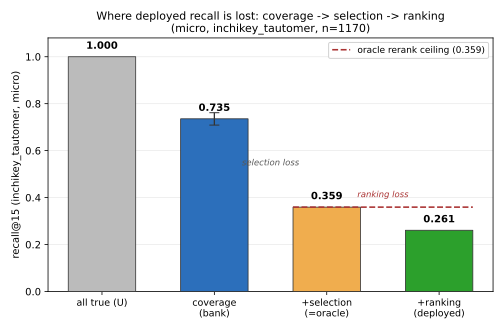

# GRAIL: rule-based metabolite-structure prediction, a coverage×selection×ranking diagnosis, and the TAME evaluation protocol

> **Draft status (2026-07-13):** first assembled full draft. Numbers sourced from `docs/GRAIL_FRAMING.md` / `results/*.json`. Compute-gated values are marked `[PENDING: ...]`; unverified citations are marked `[cite: ...]`. Venue target: JCIM / J. Cheminformatics.

## Abstract

Rule-based metabolite-structure prediction is usually reported as a single top-k recall number,
as if that transparently reflected a method's chemistry-generation capability. It does not:
recall conflates whether a rule bank *covers* a transformation, whether a model *selects* the
right rule, and whether it *ranks* the resulting candidate into a bounded output — and shifts
under whichever structural-match convention a paper adopts. We present **GRAIL**, a three-stage
rule-based-plus-learned predictor (a curated 7,581-SMIRKS bank, a learned rule selector, and a
PU-trained pair filter), and use it to decompose recall into coverage × selection × ranking. On a
leakage-audited, molecule-disjoint clean test split (1170 substrates), the rule bank's coverage
ceiling is **0.735** (tautomer-InChIKey, micro), but the deployed pipeline converts only 35.5% of
that ceiling into realised recall@15 = **0.261** (micro) `[PENDING: multi-seed mean±std]`, a gap
**dominated by a selection loss** (selection_retention = **0.489**) larger than the ranking loss.
Stated up front: **GRAIL does not win on recall** — 0.330 macro recall@15 `[PENDING: multi-seed mean±std]`, below SyGMa (0.572) and
MetaPredictor (0.585, on the n=150 tier-2 subset). We also introduce **TAME**, a tautomer-aware,
leakage-audited matching and re-scoring protocol, and show with a pre-declared primary endpoint
that match-protocol choice is a method-dependent confounder that can reverse method rankings
(interaction **+0.120**, 95% CI **[+0.073, +0.171]**). GRAIL's contribution is the coverage
ceiling as a diagnostic primitive, the decomposition, the protocol, and an honestly-diagnosed
interpretable instrument — not a state-of-the-art claim.

## 1. Introduction

Metabolite-structure prediction — given a xenobiotic or drug substrate, predicting the structures
its Phase-1/Phase-2 biotransformations produce — sits at the intersection of drug metabolism,
toxicology, and structure-generation modeling. Two lineages dominate the field: expert-curated
reaction-rule engines (SyGMa, GLORYx, BioTransformer) applying hand-tuned SMIRKS transformations,
and learned sequence-to-sequence or ensemble models (MetaTrans, MetaPredictor) emitting candidate
structures directly. Comparisons across these lineages — even within the rule-based lineage — are
usually reported as a single top-k recall number, as though that number transparently reflects a
method's underlying chemistry-generation capability.

It does not. A rule-based predictor's realised recall is the product of at least three largely
independent capacities: whether the rule bank *covers* the transformation at all, whether the
model *selects* the right rule out of the ones the bank offers, and whether it *ranks* the
resulting candidate correctly into a bounded top-k output. A single aggregate recall number
conflates all three — a predictor with a rich bank but a poor selector looks identical, on that
number, to a predictor with a narrow bank and a perfect selector. Nor is the number comparable
across papers: the field has never agreed on what counts as a structural "match" — plain
InChIKey, InChI-without-stereo, canonical-SMILES equality, fingerprint Tanimoto = 1, or a
tautomer-aware canonicalization — so leaderboards built under different match conventions are not
directly comparable, even when scoring identical chemistry.

We state our headline result up front, because it runs against the grain of most papers in this
space: **GRAIL does not win on recall.** On a leakage-audited, molecule-disjoint clean test split,
GRAIL reaches 0.330 macro recall@15 (0.261 pooled/micro) `[PENDING: multi-seed mean±std]` — below
both SyGMa (0.572) and MetaPredictor (0.585, on the n=150 tier-2 subset on which all five compared
methods are jointly scored). §9 certifies this independently with a paired bootstrap and an exact
McNemar test, both wholly significant against GRAIL. GRAIL enters its own comparison as one honest
row, not the winner.

What GRAIL *is* useful for is turning that loss into a measurement. Its three stages — a learned
rule selector, deterministic RDKit rule application, and a PU-trained pair filter — are each
inspectable, letting us ask, for the rule-based paradigm generally and not only for GRAIL, how
much headroom the rule bank has (coverage), how much of it the selection stage retains, and how
much of what survives it the ranking stage correctly surfaces. That decomposition, not a
leaderboard placement, is this paper's central instrument.

We make four contributions:

1. **The rule-bank coverage ceiling as a diagnostic primitive.** We measure the best achievable
   recall under perfect selection and ranking — **0.735** tautomer-InChIKey recall@15 on the full
   clean test split — and show it generalizes, with attenuation, to an external substrate set: a
   reusable measurement independent of any particular selection or ranking model.

2. **An exact coverage × selection × ranking recall decomposition, with three refutable
   propositions.** We derive an identity factoring realised recall into `coverage_bank ·
   selection_retention · ranking_conversion`, populate it on the deployed pipeline (dominant loss
   at `selection_retention` = **0.489**, larger than the ranking loss), and propose three
   falsifiable explanations for the loss — a surrogate-objective mismatch in ranking, a
   propensity-PU identifiability limit on selection, and a single-step paradigm bound on coverage
   — each with evidence and an open falsification test.

3. **TAME, a standardized, tautomer-aware, leakage-audited matching protocol, with a
   match-sensitivity analysis.** We show, with a pre-declared primary endpoint, that match-
   convention choice is a method-dependent confounder, not a neutral scoring detail: the
   differential sensitivity between GRAIL and BioTransformer moving from canonical to
   tautomer-InChIKey matching is **+0.120** (95% CI **[+0.073, +0.171]**) — enough to reverse
   method rankings a fixed convention would report as stable.

4. **GRAIL as an interpretable, honestly-diagnosed instrument.** We report GRAIL as one row in its
   own comparison table, not a state-of-the-art claim: rule selection, product enumeration, and
   pair-plausibility scoring are each individually inspectable, letting contribution 2's
   decomposition attribute loss to a specific pipeline stage rather than an opaque end-to-end
   score.

The remainder of the paper: §2 situates GRAIL against rule-based and learned prior art; §3–§5
describe the architecture, the formal decomposition, and the TAME protocol; §6–§9 report the
coverage ceiling, its external validity, the recall decomposition, and the honest-anchor
certification; §10 develops the three propositions; §11 quantifies match-sensitivity across five
methods and five matching protocols; §12–§14 close with limitations, data/code availability, and
conclusions.

## 2. Related Work

Metabolite-structure prediction spans two lineages: expert-curated reaction-rule systems and
learned sequence-to-sequence or ensemble models. **SyGMa** (Ridder & Wagener 2008, *ChemMedChem*,
doi:10.1002/cmdc.200700312) applies a curated SMIRKS library scored by empirical biotransformation
probabilities, covers roughly 70% of human biotransformations, and reproduces 68% of test
metabolites (30% within its own top-3). **GLORYx** (de Bruyn Kops et al. 2020, *Chem Res Toxicol*,
doi:10.1021/acs.chemrestox.0c00224) pairs a site-of-metabolism classifier with reaction rules,
reports 77% recall (AUC 0.79), and explicitly finds phase-2 (conjugation) ranking harder than
phase-1 — a finding our own ΔMW long-tail analysis (§10) independently reproduces. **BioTransformer
3.0** (Djoumbou-Feunang et al. 2019, *J Cheminform*) combines knowledge-based and machine-learned
rules for broad-scope in-silico metabolism. On the learned side, **MetaTrans**
`[cite: Litsa, Das, Kavraki 2020, Chem Sci; verify vol/DOI]` is an end-to-end transformer ensemble
emitting an unranked SMILES-to-SMILES candidate set, and **MetaPredictor**
`[cite: MetaPredictor — verify]` is a comparable transformer-ensemble baseline. GRAIL sits between
these lineages — rule-grounded like SyGMa/GLORYx/BioTransformer, but with a learned rule-selection
stage in place of a fixed probability table.

We are not the first to place several of these tools side by side, and we cite the two prior
multi-method comparisons as **corroboration**, not a threat to novelty. Scholz et al. 2023
(*Sci Total Environ*) benchmarked SyGMa, GLORY, GLORYx, BioTransformer 3.0, and MetaTrans on 85
agrochemical parents and found low first-generation precision (~18%, falling to ~2% over three
generations) and strong divergence between rule-based and ML tools — both reproduced by our own
precision-lower-bound framing and rank-flip analysis (§11). Boyce et al. 2022 (*Comput Toxicol*,
doi:10.1016/j.comtox.2021.100208) compared SyGMa, Meteor Nexus, BioTransformer, TIMES, OECD
Toolbox, and CTS on 37 chemicals and found SyGMa had the highest raw coverage but was "prone to
significant overprediction" (5,125 metabolites, 54.7% of all predictions; precision 1.1–29%) —
direct external support for the output-budget confound our budget-matched view (§11,
`mean_output_size`) controls for. Neither prior comparison standardized the structure-match
definition, audited train/test leakage, or asked whether the ranking is stable under the match
choice; that triad is where we differ in protocol, not in the fact of comparison.

The structure-matching protocol used throughout (§5, `inchikey_tautomer`) is grounded in prior
standardization work, not invented from scratch. Dhaked et al. 2019
`[cite: Dhaked 2019 — verify DOI]` catalog dozens of tautomer transforms and show standard InChI
normalizes only a subset of them, so plain-InChI matching systematically misses keto–enol and
carbon-shift tautomer pairs — the same failure mode our merge check and rule-bank ceiling gap (§6)
surface directly. Hähnke et al. 2018 (*J Cheminform*, PubChem standardization) report that 60% of
PubChem structures differ from their canonical InChI form, mainly due to tautomer choice. Mansouri
et al. 2024 (*J Cheminform*, QSAR-ready standardization) describe a comparable
desalt/destereo/tautomer-canonicalization pipeline, precedent for the `standardize_mol` path used
here. Tautomer standardization is thus established *preprocessing*; what is new is adopting it as
the *matching* protocol and quantifying how far it moves the leaderboard (§11's interaction
confidence interval).

Leakage-aware splitting is likewise not new in general — **DataSAIL**
`[cite: DataSAIL — verify DOI]` splits datasets to minimize cross-split similarity, benchmarked
against DeepChem, LoHi, and GraphPart on MoleculeNet-style tasks. We contribute not a new
splitting algorithm but a metabolite-specific molecule-disjoint audit — substrate–metabolite
identity overlap is the leak that matters here — backed by a machine-checkable leakage report and
validation-versus-test agreement (§5). And that evaluation choices reorder leaderboards is
established outside chemistry: Mishra et al. 2021 show difficulty-weighting reorders NLP/ML
leaderboards so "top models may not be best," and Rodriguez et al. 2021 show individual evaluation
examples carry unequal ranking information. The domain-specific instantiation is ours: in
metabolite *structure* prediction, the previously-unexamined, load-bearing choice is how a
predicted structure is matched to its reference (canonical SMILES, InChIKey, no-stereo InChI,
Tanimoto = 1, or tautomer-aware InChIKey), and §11 shows this single choice reorders the
leaderboard across two independent method pairs, including one non-monotone response (MetaTrans).

We make no claim to being first on any individual axis: not the first to compare
metabolite-structure predictors (Scholz 2023; Boyce 2022), not the first to standardize chemical
structures for comparison (PubChem; QSAR-ready pipelines), not the first to build a leakage-aware
split (DataSAIL). TAME's contribution is their first **joint instantiation** for metabolite
structure prediction specifically: a standardized, tautomer-aware matching protocol, a
leakage-audited molecule-disjoint split, a match-sensitivity ("rank-flip") analysis showing the
leaderboard is not match-invariant, and — via GRAIL run through the identical harness as one
honest, interpretable row — a coverage × selection × ranking decomposition of where a rule-based
paradigm's headroom is lost. GRAIL is offered throughout as a diagnosed instrument, not a
recall-superiority claim. One benchmark reference flagged in earlier planning notes,
`[resolve: "Gao 2026"]`, could not be located in this literature pass (the nearest 2026 candidate,
Giné et al., addresses MS/MS spectral annotation, a different task) and is left unresolved pending
confirmation of which source was intended.

## 3. Methods — GRAIL architecture

GRAIL predicts xenobiotic metabolite structures with a three-stage, rule-based-plus-learned
pipeline. The first stage, the **generator**, is a learned multi-label rule selector that
approximates `P(r|s)` — the probability that rule `r` applies to substrate `s` — over a curated
bank of **7,581 SMIRKS** rules; the default scorer is retrieval-based, combining cross-attention
between substrate and rule graph embeddings, an embedding-similarity term, and an MLP head. The
second stage, **RDKit rule application**, mechanically applies every rule the generator selects
and enumerates the resulting candidate products, retaining provenance of which rule produced which
candidate. The third stage is a **PU-trained, MCS-aware pair filter**: a binary classifier scoring
each (substrate, product) pair. Its training data are positive-unlabeled — annotated true
metabolites are the only positives, while rule-applicable products lacking a positive annotation
are treated as *unlabeled*, not as confirmed negatives, since absence of an annotation does not
certify a transformation does not occur. The filter is accordingly trained in the logit domain
(`return_logits=True`) so a PULoss/nnPU surrogate operates on raw classifier outputs rather than
post-sigmoid probabilities, and the generator itself down-weights unobserved-but-applicable rules
rather than penalizing them as hard negatives. Featurization uses fixed-width graphs: single-molecule
graphs feed the generator encoder with 16-dim node features, while the pair filter operates on
merged substrate–product graphs with 18-dim nodes and 18-dim edges plus a 1024-dim Morgan
fingerprint branch; cross-edges linking substrate and product atoms come from an element-aware
maximum common substructure (MCS) atom correspondence rather than sorted or arbitrary indices,
preserving chemically meaningful atom mappings across the reaction. At deployment,
`ModelWrapper.generate` runs all three stages and ranks the candidate set by
`filter_score × generator_score`, combining the filter's pair-plausibility judgment with the
generator's rule-selection confidence into a single ranking signal. Throughout this paper, unless
stated otherwise, structure matching between predicted and reference metabolites uses
`inchikey_tautomer` as the default match mode. The three stages together form an interpretable
instrument — the selected rule, the enumerated product, and the filter's pair judgment are each
inspectable — and the contribution we claim is interpretable learned rule selection paired with a
PU-aware pair filter, not recall supremacy over other metabolite predictors.

## 4. Methods — Formal framework

The architecture of §3 and the coverage ceiling and recall decomposition reported later (§6, §8)
are unified by one compact generative model, which also gives the three propositions of §10 a
principled home. The framework is deliberately thin: one likelihood, one decomposition, one
lever→factor map — it is not a rewrite of the empirical results that follow.

**A generative latent-reaction mixture.** For a substrate `s`, a metabolite `m` arises by choosing
a transformation rule `r`, choosing a firing site, and applying the rule:

```
P(m | s) = Σ_r Σ_{site ∈ sites(r,s)} P(r | s) · P(site | r, s) · 𝟙[ apply(r, s, site) = m ]
```

The application term is deterministic given RDKit, so the inner indicator collapses to the
enumerable product support; the latent variables are *which rule fired* and *at which site*, and
the observation — the annotated metabolite set — is positive-unlabeled: a rule-applicable,
non-annotated product is unlabeled, not a certified negative. The three deployed stages of §3 are
one marginal-likelihood approximation of this model — the model the pipeline approximates, not a
claim that the trained weights are its MLE. The **generator** approximates `P(r | s)` (rule
selection); its persisted `rule_prior_logits` is the marginal `π(r) = P(r fires)`. **RDKit rule
application** realises the deterministic support `𝟙[apply(r,s,site)=m]`, enumerating candidate
products. The **filter** approximates a discriminative correction `P(true | s, m)` over the
enumerated candidates. Deployment ranks by `filter_score × generator_score`. PU training
approximates EM over the unobserved rule-firing indicator.

**A recall decomposition.** Fix top-k. For substrate `s`, let `T_s` be the true references and let
the candidate sets nest `R_s(k) ⊆ P_bud,s ⊆ P_full,s`, where `P_full,s` is the full-bank depth-1
rule-applicable pool (the coverage ceiling of §6), `P_bud,s` the deployed budget-limited pool after
generator selection, and `R_s(k)` the top-k ranked output. With `hit(A_s)` the number of references
matched by set `A_s` under the tautomer-InChIKey quotient (monotone under inclusion) and pooled
(micro) sums `U=Σ|T_s|`, `C_full=Σ hit(P_full,s)`, `C_bud=Σ hit(P_bud,s)`, `H=Σ hit(R_s(k))`:

```
recall@k = H/U = (C_full/U) · (C_bud/C_full) · (H/C_bud)
                = coverage_bank · selection_retention · ranking_conversion
```

Because the sets nest, each factor lies in [0,1] and the three multiply out exactly to the
realised recall on any numbers — it is an accounting identity, not a theorem; its only use is to
localise where recall is lost across the pipeline, and its exact cancellation is never offered as
evidence for anything beyond that bookkeeping. Qualitatively, `coverage_bank` coincides with the
rule-bank ceiling reported in §6.

**Lever → factor map.** Every diagnostic in §10 and each proposition attaches to exactly one
factor:

| factor | levers & propositions |
|---|---|
| `coverage_bank` | multi-step rule application (depth-2), the ΔMW coverage gap, the external-validity composition covariate (§7), Proposition 3 |
| `selection_retention` | the learned-vs-prior rule-selection probe, data-scaling saturation, Proposition 2 |
| `ranking_conversion` | the filter / listwise reranker, the oracle bound, Proposition 1 |

## 5. Methods — TAME evaluation protocol

We package the evaluation apparatus as **TAME** — the **T**automer-**A**ware
**M**etabolite-structure **E**valuation protocol: a tautomer-InChIKey match quotient, a
leakage-audited molecule-disjoint train/val/test split, and a frozen multi-method re-scoring
harness. TAME is a *protocol + audited split + re-scoring harness*, not a leaderboard service —
it exists so the numbers in §6–§9 are apples-to-apples and regenerable from committed
artifacts, not to rank community submissions.

**Matching protocol.** The field has never agreed on what counts as a "match": GLORYx uses a
stereo-blind InChIKey skeleton, MetaTrans uses Morgan-fingerprint Tanimoto=1, and LAGOM uses
canonical SMILES equality. TAME exposes each as an explicit, named quotient rather than picking
one silently: `canonical` (stereo-free canonical SMILES equality), `inchikey` (the
literature-standard full InChIKey), `inchi_no_stereo` (the InChIKey skeleton block, stereo-blind,
as GLORYx uses), `tanimoto1` (identical Morgan fingerprint, as MetaTrans uses), and
`inchikey_tautomer` (tautomer-canonicalize both predicted and reference structures before taking
the InChIKey) — **our recommended default**. Plain InChI only normalizes a *subset* of tautomers,
so a rule-emitted tautomer of a reference routinely fails to match under plain `inchikey` even
though it is the same chemical entity; tautomer-canonicalizing both sides first closes that gap
and is the most defensible structure-identity criterion for a rule-driven generator. Unless
stated otherwise, all results outside §11 use `inchikey_tautomer`; §11 quantifies how much the
method ranking depends on which of the five quotients is used.

**Split and leakage audit.** All splits are molecule-disjoint: no substrate in test or val
appears in train, and no test substrate appears in val. The clean triples are built and verified
by `scripts/fix_splits.py --molecule-disjoint`, which canonicalizes SMILES, removes cross-split
substrates, and checks zero substrate and zero positive-pair overlap, emitting its audit summary
to `results/leakage_fix_report.json` when run. Trustworthiness is corroborated empirically, not
merely asserted: recall@15 tracks closely between val and test (0.327 vs 0.330), inconsistent
with test-set overfitting.

**Metrics.** We lead with recall@k, co-reported with `mean_output_size` rather than precision
alone, since precision is a pessimistic lower bound under incomplete annotation — an unannotated
candidate is scored a false positive even though it may be a real, simply unrecorded, metabolite.
Selection of models, presets, and hyperparameters happens exclusively on the validation split;
the test split is touched once, for the final reported numbers.

**Worked example.** The quotient dependence is not hypothetical. Consider a predicted set
`{D-alanine, acetone (enol tautomer)}` scored against annotated references `{L-alanine, acetone
(keto tautomer)}`. Under strict `inchikey`, both predictions miss: the alanine pair differs at a
stereocenter, and the acetone pair differs only by a keto/enol tautomerization outside the subset
plain InChI normalizes, so it also misses under `inchi_no_stereo`. `inchikey_tautomer`
standardization additionally strips stereochemistry (canonical SMILES generated with
`isomericSmiles=False`), so tautomer-canonicalizing both sides collapses both gaps at once: the
acetone keto/enol pair becomes a hit *and* the D-/L-alanine stereocenter pair becomes a hit,
scoring full recall on this example. The same fixed predictions can therefore score as a
near-total miss or a full hit purely by changing the match quotient, with no change to the
underlying chemistry — the phenomenon §11 quantifies across methods and the shared external set.

## 6. Results — Rule-bank coverage ceiling

The rule bank's **recall ceiling** — the best achievable recall if rule selection and ranking
were both perfect, i.e. the full-bank depth-1 `apply_rules` pool matched against the annotated
references — on the full clean molecule-disjoint test split (1170 substrates, 2597 true pairs) is
**0.718 (plain InChIKey) / 0.735 (tautomer-InChIKey)**, recovering **1865 / 1910 of 2597** true
pairs. This is far above the best learned end-to-end systems on this benchmark (recall@15 roughly
0.47–0.585) and comparable to other rule-based systems evaluated on their own sets. **Coverage is
high; the bank is powerful.** The practical consequence is that the GRAIL task is limited by
*coverage-conversion* — a dominant selection loss followed by a ranking loss, quantified in §8 —
not by rule expressiveness.

Both ceiling figures are reported under the **same tautomer-InChIKey protocol used for GRAIL and
SyGMa** throughout this paper (no mixed match modes across methods). The plain-InChIKey figure,
0.718, exactly reproduces the previously reported ceiling, which validates that this run of
`scripts/run_benchmark.py` is consistent with earlier measurements. The same run co-measures the
**SyGMa** baseline on the identical split under both protocols: recall@15 **0.558 plain / 0.572
tautomer** (n=1168 substrates with SyGMa-scoreable output) — so the rule-bank ceiling, SyGMa, and
GRAIL are now all reported under one shared tautomer-InChIKey standard.[^tautomer-audit]

| system | protocol | recall | n |
|---|---|---|---|
| **rule-bank ceiling** (full bank, depth-1) | tautomer-InChIKey | **0.735** (1910/2597) | 1170 |
| rule-bank ceiling (full bank, depth-1) | plain InChIKey | 0.718 (1865/2597) | 1170 |
| SyGMa (recall@15) | tautomer-InChIKey | 0.572 | 1168 |
| SyGMa (recall@15) | plain InChIKey | 0.558 | 1168 |
| learned end-to-end systems (recall@15, literature) | mixed / method-specific | ~0.47–0.585 | — |

*Source: `results/benchmark_report.json` / `scripts/run_benchmark.py`.*

[^tautomer-audit]: The tautomer match is computed via a heavy-atom-formula prefilter for
tractability; an audit against naive (unfiltered) tautomer keying on 50 substrates found the
prefilter sound — mismatch = 0.

## 7. Results — External validity of the ceiling

The internal ceiling `coverage_bank = 0.735` (the **micro**, pooled ratio-of-sums estimate `Σhit /
Σtrue` — not a per-substrate mean; within-substrate pairs are dependent so a mean-of-ratios would
misrepresent the uncertainty) carries a cluster-bootstrap 95% CI of **[0.709, 0.762]** (resampling
substrates, 10,000 resamples). Recomputed apples-to-apples on an **external** set — the 37 GLORYx
parent substrates, one uncapped full-bank depth-1 `apply_rules` pass, no pool cap, the same
tautomer match — the external ceiling is **0.633** (95% CI **[0.531, 0.733]**, n=37, wide by
design at this sample size). This is far above the previously committed figure of **0.3715**,
which is **pool-capped** — a generator-budget artifact inherited from `gloryx_oracle.json` — and
must **never** be read as "the external ceiling."

Internal (0.735) and external (0.633) both sit in the **micro** frame. A separate question is
whether the internal-external gap is compositional: GLORYx parents tend to be larger,
more-conjugated drugs than the internal test set, and the ΔMW long tail noted in §4/§10 suggests
coverage should degrade with molecular complexity. One OLS regression of **per-substrate**
coverage on molecular descriptors (molecular weight, ring count, aromatic-atom count, heteroatom
count, a conjugation-site count, and `n_true`) fit across both populations predicts **macro**
(per-substrate-mean) coverages of **~0.79** internal and **~0.74** external, in-sample — the macro
frame, distinct from the micro ceilings quoted above. Note honestly that this ~0.74 in-sample
external prediction sits *above* the measured external macro coverage of 0.697, so the in-sample
fit alone overstates transferability. Holding the external points fully out of the fit
(fit-internal-only → predict-external) instead lands at **0.738 out-of-sample**, recovering
**~56%** of the internal→external macro-coverage gap
(`regression.predicted_external_mean_oos = 0.738`, `regression.gap_recovery_frac = 0.565`). This
out-of-sample number, not the in-sample one, is the transferable claim.

We frame this as a **suggestive partial composition effect at n=37** — consistent with, but not
proof of, molecular composition driving part of the internal-external coverage gap — and
explicitly *not* a fitted or transferable law, and *not* a defect in the rule bank or the matching
protocol.

> _[FIGURE: internal-vs-external coverage scatter — optional, post-draft]_

*Source: `results/ceiling_external_validity.json`.*

## 8. Results — Recall decomposition

We now populate the §4 identity `recall@k = coverage_bank · selection_retention ·
ranking_conversion` with measured values, on the common clean molecule-disjoint test split (n=1170
substrates, tautomer-InChIKey, k=15; pooled/micro ratio-of-sums; 10,000-resample substrate
block-bootstrap; `results/recall_factorization.json`). The deployed pipeline realises **recall@15
= 0.261** `[PENDING: multi-seed mean±std over ≥3 seeds]` — a single deployed checkpoint, not yet a
multi-seed estimate.

| factor | value | 95% CI | reading |
|---|---|---|---|
| `coverage_bank` (C_full/U) | **0.735** | [0.709, 0.762] | equals the §6 rule-bank ceiling |
| `selection_retention` (C_bud/C_full) | **0.489** | [0.458, 0.520] | **the dominant loss** |
| `ranking_conversion` (H/C_bud) | **0.726** | [0.687, 0.765] | top-k ordering of the retained pool |
| product = micro recall@15 | **0.261** | — | 0.735 · 0.489 · 0.726 |

The **oracle** recall — the deployed candidate pool ranked perfectly (`ranking_conversion = 1`) — is
`C_bud/U =` **0.359** (micro). The single largest leak in the pipeline is
**`selection_retention = 0.489`**: fewer than half of the metabolites the full rule bank could in
principle recover survive into the deployed, budget-limited candidate pool. That is a **selection**
failure — the generator's rule choice plus the generation budget — and it is upstream of, and
larger than, the ranking loss. The decomposition's main use is exactly this localisation: it points
at *which* stage to fix, not at ranking alone.

Restated as a conversion rate, the deployed pipeline turns the **0.735** rule-bank ceiling into
**0.261** realised recall@15, a **35.5% conversion** (0.261 / 0.735). Because conversion is the
product of the last two factors, `selection_retention × ranking_conversion = 0.489 × 0.726`, this
35.5% is not one ranking failure but **two losses in series**, with selection (0.489) the larger of
the two and ranking (0.726) a smaller second cut on top of it.

**Figure 2** draws this as a waterfall on the same n=1170 population:



**Figure 2.** Recall decomposition waterfall, one common n=1170 population (tautomer-InChIKey,
micro ratio-of-sums): `U (1.0) → coverage_bank (0.735) → coverage·selection = oracle recall (0.359)
→ deployed recall (0.261)`, with the oracle line marking the ceiling on the ranking bar; the
coverage bar carries a 95% CI whisker and all three factor CIs are listed in the accompanying table. Bar-1→Bar-2 is the selection loss; Bar-2→Bar-3 the ranking loss.

Throughout, cross-method recall@15 is the per-substrate mean (macro): GRAIL **0.330**, SyGMa
**0.572**; the decomposition uses the pooled (micro) frame — the only frame in which the three
factors multiply exactly to the realised recall and `coverage_bank` equals the 0.735 ceiling — in
which deployed recall is **0.261**.

As established in §4, this is a **decomposition**, not a theorem: the identity telescopes and
closes on any numbers, so its exact cancellation is never offered as evidence for anything beyond
bookkeeping. Its only role here is to localise the loss to `selection_retention`, which motivates
the §10 diagnostics (the learned-vs-prior rule-selection probe and data-scaling saturation) and
Proposition 2.

*Source: `results/recall_factorization.json`.*

## 9. Results — Honest-anchor certification

GRAIL's loss to SyGMa (§8: deployed **0.330** macro vs SyGMa **0.572**) is not a sampling artifact
of which substrates happened to be scored. On the common substrate set shared by both methods
(n=1168, tautomer-InChIKey; `results/anchor_certification.json`), the paired per-substrate
difference `recall_GRAIL − recall_SyGMa` is **−0.242**, 95% CI **[−0.271, −0.212]** — wholly below
zero — computed by a 10,000-resample substrate block-bootstrap. An independent, distribution-free
check on the binary any-hit@15 outcome, the exact McNemar test, agrees: **b = 87** substrates hit
by GRAIL but missed by SyGMa vs **c = 379** hit by SyGMa but missed by GRAIL, **p ≈ 1.7×10⁻⁴⁴**.
The common-subset ceiling (**0.736**) matches the full-1170 ceiling (**0.735**), so restricting to
the common set does not bias the comparison — it is representative of the full population.

Scope matters here. The paired bootstrap covers continuous recall; McNemar covers only the binary
any-hit outcome. Together they certify **evaluation** variance — the uncertainty from scoring one
fixed, already-trained checkpoint over resampled/discordant substrates — not **training** variance
across independently seeded runs. The split itself is not overfit (val ≈ test), but the variance
certified here is evaluation variance only: the deployed **0.330** headline is a single checkpoint,
not a seed average `[PENDING: multi-seed mean±std]`. Within that scope, the result is unambiguous:
**SyGMa > GRAIL is significant — the anchor holds.**

> _[FIGURE: paired-Δ / McNemar — optional, post-draft]_

## 10. Results — Diagnosis: levers and three propositions

Each lever below attaches to exactly one factor of the §4 decomposition (annotated in the Factor
column); the table is followed by three refutable Propositions that localise *why*, not merely
*where*, recall is lost.

| Lever | Factor | Finding | Evidence |
|---|---|---|---|
| **Learned vs. prior** *(top_k-limited rule-selection probe — not deployed recall)* | `selection_retention` | A SyGMa-style frequency prior significantly out-ranks the learned generator: gen-only recall@15 prior-only **0.410** vs learned-only **0.266** (Δ **−0.144**, 95% CI **[−0.196, −0.095]**, paired bootstrap, n=245); with the filter, 0.405 vs 0.300 (Δ −0.105, CI [−0.152, −0.058]). Adding the prior to the learned scorer lifts **+0.130** gen / **+0.099** filter (both significant); the filter significantly helps only the *weak learned* ordering (+0.034, CI [+0.011, +0.061]), not the strong prior (n.s.). | `results/prior_vs_learned.json` (245 test subs) |
| **Multi-step (depth-2)** | `coverage_bank` | Breadth-capped depth-2 rule application lifts the ceiling by only **+0.012** (0.711→0.723) at **8.5×** candidate cost (194→1653 candidates/substrate) — not the dominant coverage lever. | `results/benchmark_report_depth2.json` (150 subs, beam 10) |
| **Coverage (ΔMW gap)** | `coverage_bank` | **26.9%** of true metabolites are uncovered by the depth-1 bank (plain InChIKey; ~25% under tautomer). Misses are a diverse long tail — the top missing class (hydroxylation/oxidation) is only **6%** of uncovered. | `results/benchmark_report_gap.json` (500 subs) |
| **Data scaling** | `selection_retention` | Recall saturates (2418→4787 substrates ≈ flat) — the plateau is not a data-quantity problem. | `results/full{2500,5000}_single.log` |
| **Regioselectivity (SoM)** | `ranking_conversion` | A site-of-metabolism prior gives only a small lift — regioselective ranking is hard within the bank. | `results/train_som.log` |

**Probe vs. deployed.** The learned-vs-prior row is a controlled, top_k-limited rule-selection
**probe** (each mode picks its own top-30 rules, same downstream product loop and filter) — it is
*not* the deployed recall. The deployed pipeline applies rules broadly rather than through a
top_k selector and is measurably **prior-independent**: on an earlier 291-substrate evaluation,
two checkpoints differing only in whether a trained prior buffer was present gave essentially
identical recall (0.335 vs 0.334), so deployed recall (**0.330** macro / **0.261** micro, §8–§9)
is coverage-limited, not prior-limited — the probe *reveals* the learned selector's weakness;
deployment *masks* it by not depending on that selector's ranking. *Honesty note:* an earlier
draft reported the opposite — "learned beats prior" — an artifact of a checkpoint whose prior
buffer was un-persisted; that reversal is withdrawn and corrected here, caught by adversarial
verification. Neither multi-step application nor any single rule-family addition moves coverage
much (misses are a diverse long tail), and data scaling is flat — so the dominant, addressable
loss remains `selection_retention` (§8: 0.489), the learned rule-selector performing worse than a
trivial frequency prior in the probe. The three Propositions below explain *why*.

**Proposition 1 — Surrogate mismatch (→ `ranking_conversion`).** A filter trained by a strictly proper scoring rule (BCE/PU) learns a globally calibrated posterior, Bayes-optimal for AUC and calibration; ranking each substrate's candidate pool by that posterior and taking top-k is recall@k-optimal only when pools are homogeneous. GRAIL's pools vary in size (17–150) and positive rate (`n_true` 1–18), so a pointwise-calibrated scorer can be recall@k-suboptimal even while a listwise, ranking-consistent surrogate dominates — supported by a minimal 2-substrate counterexample (`grail_metabolism/tests/test_prop1_counterexample.py`) in which the recall-superior reorder is verified *not* globally calibrated, so a proper-scoring objective rejects it. *Confirmation:* a listwise-InfoNCE reranker of similar capacity beats the pointwise filter as a ranker, **0.433 → 0.500 @15 (+0.067)**, 74% of the **Stage-2 oracle 0.677** — confirmed on a held-out Stage-2 run (`docs/benchmark/stage2_ranker_evidence.md`, Spike-3) `[PENDING: paired CI — currently 3-seed std (±0.015), not a paired bootstrap]`. *Guardrail:* this is a theorem about **objectives**, not a recall win — the reranker's **0.500 still loses to SyGMa (0.558)** and is reported only as a separate Stage-2 artifact, never as a headline number.

**Proposition 2 — Propensity-PU identifiability (→ `selection_retention`).** Under PU annotation with an approximately constant labeling propensity (SCAR), a learner with constant unlabeled weighting recovers a propensity-distorted score whose dominant component is the marginal rule-firing rate `π(r)` — the frequency prior — so the prior is Bayes-competitive **by construction**, and the learned selector improves on it only if substrate-conditional prevalence variation exceeds estimation noise; the observed data-scaling saturation (table, row 4) indicates it does not at current scale. *Anchor:* learned-only **0.266** vs prior-only **0.410** (gen-only @15, Δ **−0.144**, 95% CI **[−0.196, −0.095]**, paired bootstrap, n=245; `results/prior_vs_learned.json`). *Falsifiable prediction:* reweighting the labeled loss by `1/ê(r)` (a SAR correction) should shrink the prior's edge — an **open test, not a promised fix**. *Guardrail:* the propensity model `e(r) ∝ π(r)` is an **unmeasured modeling assumption**, flagged as such — this is an explanatory model plus a refutable prediction, not proof that learning cannot win, and it is consistent with the deployed pipeline's prior-independence noted above.

**Proposition 3 — Paradigm limit (→ `coverage_bank`).** Single-step rule-based recall ≤ single-step `coverage_bank` < 1, because a non-vanishing fraction of references are multi-generation (e.g. oxidation → conjugation) and unreachable by any single rule application — an irreducible residual that no ranking improvement can recover. *Witnesses:* depth-2 rule application lifts the ceiling by only **+0.012** at **8.5×** candidate cost (table, row 2; `results/benchmark_report_depth2.json`); on the external GLORYx set the uncapped single-step ceiling is **0.633** (§7), whose references include single-step-unreachable multi-generation metabolites. *Guardrail:* the bound is **single-step-conditional** — it bounds the single-step paradigm, not the problem; multi-step and out-of-bank chemistry remain open coverage levers.

*Source: `results/prior_vs_learned.json`, `results/benchmark_report_depth2.json`, `results/benchmark_report_gap.json`, `docs/benchmark/stage2_ranker_evidence.md`.*

## 11. Results — Match-sensitivity and cross-method comparison

§7's acetone/alanine example showed that a fixed pair of predictions can score as a near-total
miss or a full hit purely by changing the match quotient. We now quantify that effect across
methods, not one worked example, to establish that **prior rule-vs-learned comparisons in the
literature are confounded**: each paper matches predictions to references under its own convention
— GLORYx by InChI-without-stereo, MetaTrans by fingerprint Tanimoto = 1, LAGOM by canonical SMILES,
rule engines by plain InChIKey — and because that choice interacts with method-specific output
habits (stereo emission, tautomer form), leaderboards under different conventions are not
comparable even on the same chemistry.

The analysis spans **5 methods** — GRAIL, SyGMa, BioTransformer, MetaPredictor, MetaTrans — scored
under **5 match protocols**: canonical SMILES (LAGOM), plain InChIKey, InChI-without-stereo
(GLORYx), Tanimoto = 1, and tautomer-InChIKey (this paper's protocol). All 5 methods' predictions
are frozen and re-scored by one harness (`results/match_sensitivity_5method.json`), so only the
match rule changes across columns, not the chemistry. (LAGOM itself was scoped but is unusable —
weights were never released — and is excluded from the table.)

| method | canon (LAGOM) | InChIKey | no-stereo (GLORYx) | Tanimoto=1 | tautomer (ours) | mean_output_size |
|---|---|---|---|---|---|---|
| **GRAIL** | 0.356 | 0.357 | 0.358 | 0.356 | 0.365 | 8.65 |
| BioTransformer | 0.315 | 0.435 | 0.439 | 0.315 | 0.444 | 10.77 |
| SyGMa | 0.514 | 0.547 | 0.548 | 0.514 | 0.554 | 74.15 |
| MetaTrans | 0.523 | 0.494 | 0.561 | 0.524 | 0.561 | 12.71 |
| MetaPredictor | 0.531 | 0.570 | 0.578 | 0.532 | 0.585 | 11.15 |

**Table 3.** recall@15 by method × match protocol, n=150 shared substrates (`results/match_sensitivity_5method.json`).
GRAIL is listed first as the honest anchor, never the headline. `mean_output_size` exposes SyGMa's
large candidate budget (74.15 predictions/substrate vs 8.65–12.71 for the other four) — recall
alone is not apples-to-apples either. **Tier-2 comparators (BioTransformer, MetaPredictor,
MetaTrans) are scored on the n=150 shared subset; GRAIL and SyGMa on the full n≈1170 clean test. A
single-n rerun is future work.** Within this table, GRAIL and SyGMa are re-scored on the same
n=150 subset as the tier-2 methods so all 5 columns are paired on identical substrates for the
statistics below; that is why the table's GRAIL/SyGMa cells differ from their full-test headline
figures, restated as the honest-anchor ordering that runs through this paper: **GRAIL 0.330 macro
< SyGMa 0.572** (§6, §8–§9, `results/anchor_certification.json`) **< MetaPredictor 0.585 (n=150)**
(`results/match_sensitivity_5method.json`; all macro tautomer-InChIKey). GRAIL is not competitive on recall in either scoring — the contribution here
is the protocol, not a win.

**Primary endpoint.** The pre-declared primary endpoint of this analysis is the **differential
match-protocol sensitivity (interaction)** between GRAIL and BioTransformer: how much *more*
BioTransformer gains, moving from canonical to tautomer-InChIKey matching, than GRAIL gains over
the same move. That interaction is **+0.120, 95% CI [+0.073, +0.171]** (`results/rank_flip_ci.json`,
`interaction_B_extra_gain_from_normalization`; 150 substrates, 10,000 paired bootstrap resamples,
seed 0) — wholly above zero. This is the certified result: the match protocol is a
**method-dependent confounder**, not a neutral scoring choice.

**Two independent rank-flips** follow from that confounder. (1) **GRAIL ↔ BioTransformer**: under
canonical matching GRAIL leads (Δ = +0.041), under tautomer-InChIKey BioTransformer leads
(Δ = −0.079) — the point-estimate ranking reverses. (2) **MetaTrans ↔ SyGMa**: MetaTrans leads
SyGMa under canonical, no-stereo, and Tanimoto = 1 matching, but SyGMa leads under strict InChIKey
(MetaTrans drops to 0.494 against SyGMa's 0.547) — a second, independent reordering. **Honest note:**
neither per-pair flip is individually significant at n=150 — each pairwise Δ's CI spans zero
(GRAIL↔BioTransformer canonical: [−0.044, +0.122]; tautomer: [−0.166, +0.007], borderline). The
certified claim is the differential sensitivity that drives the flips, not the flips themselves.

**MetaTrans is also non-monotonic** in the match protocol, uniquely among the 5 methods: canon
**0.523** > InChIKey **0.494** < no-stereo **0.561**. MetaTrans emits isomeric SMILES, so strict
InChIKey penalizes stereo mismatches that stereo-blind protocols (canonical, no-stereo) ignore —
more normalization does not monotonically raise its recall. The protocol effect is therefore
**method-idiosyncratic**, not a uniform "normalization helps" story.

**Multiplicity.** Holm correction is applied *within* two declared families, not across them. (i)
The **per-method protocol-sensitivity family** — GRAIL, SyGMa, BioTransformer, MetaPredictor —
where every sensitivity (recall_tautomer − recall_canonical) is significant and the four are
mutually distinguishable: GRAIL +0.010 [+0.001, +0.025], SyGMa +0.040 [+0.014, +0.072],
MetaPredictor +0.053 [+0.022, +0.090], BioTransformer +0.130 [+0.081, +0.181] — a 13× spread with
non-overlapping CIs at the extremes. (ii) The **rank-flip pairwise family** — the per-protocol
GRAIL↔BioTransformer and MetaTrans↔SyGMa Δ contrasts, none individually significant at n=150 (the
honest note above). The recall factorization (§8), external-validity ceiling (§7), and anchor
certification (§9) are secondary/descriptive and are not counted against this error budget.

> _[FIGURE: rank-flip — regenerate rankflip.svg on current numbers, post-draft]_

*Source: `results/match_sensitivity_5method.json`, `results/rank_flip_ci.json`.*

## 12. Limitations

We state these plainly rather than let them surface in review. First, **no recall win**: GRAIL
does not win on recall anywhere in this paper. It loses to SyGMa by a certified, significant
margin (§9: paired Δ = **−0.242**, 95% CI [−0.271, −0.212]; McNemar p ≈ 1.7×10⁻⁴⁴) and to the
learned transformer baselines on the shared n=150 subset (MetaPredictor 0.585, MetaTrans 0.561,
both above GRAIL's 0.365 under the same tautomer protocol, §11). Nothing in this paper should be
read as a state-of-the-art claim; the contribution is the ceiling, the decomposition, and the
protocol, with GRAIL as one honestly diagnosed row. Second, **precision is a pessimistic lower
bound** throughout: because negatives are rule-applicable, non-annotated products rather than
confirmed non-metabolites (§3), an unannotated true metabolite is scored as a false positive, so
every precision number in this paper understates the pipeline's true precision by an unknown,
non-annotation-corrected amount — we lead with recall and `mean_output_size` for this reason and
do not report precision as a headline metric. Third, the deployed headline (recall@15 = 0.261
micro / 0.330 macro, §8–§9) is a **single checkpoint**, not a seed-averaged estimate; the
honest-anchor certification (§9)
bounds *evaluation* variance — resampling and discordance over a fixed model — not *training*
variance across independently seeded runs, and a multi-seed mean±std over the deployed pipeline
has not yet been run `[PENDING: run_multiseed.py, ≥3 seeds]`. Fourth, the five-method,
five-protocol match-sensitivity comparison (§11, Table 3) mixes sample sizes: the three tier-2
comparators (BioTransformer, MetaPredictor, MetaTrans) are scored only on the **n=150** shared
subset for which frozen third-party predictions exist, while GRAIL and SyGMa's headline numbers
elsewhere in the paper are reported on the full **n≈1170** clean test split; within Table 3 itself
GRAIL and SyGMa are re-scored on the matching n=150 subset so the five columns are paired on
identical substrates, but a single-n, five-method rerun on the full test split remains future work.
Fifth, the external-validity ceiling (§7) is measured on only **37** GLORYx parent substrates, so
its 95% CI is wide by design ([0.531, 0.733]) and the composition-effect regression that partially
explains the internal–external gap is fit on the same small external population — we frame it as
suggestive, not as a transferable law. Sixth, Proposition 2's explanatory model rests on an
**unmeasured assumption**: the propensity model `e(r) ∝ π(r)` (labeling probability proportional
to the marginal rule-firing rate) is asserted, not estimated from data, so the identifiability
argument for why the learned selector underperforms a frequency prior is consistent with, but not
proof of, the stated mechanism (§10). Finally, Proposition 3's paradigm bound is **single-step
conditional**: depth-2 rule application recovers only +0.012 ceiling at 8.5× candidate cost (§10),
so multi-step and out-of-bank chemistry remain an open, unresolved coverage lever rather than a
closed question — the bound constrains the single-step paradigm, not the metabolite-prediction
problem in general.

## 13. Data & Code Availability

All splits used in this paper are **molecule-disjoint**: no substrate in val or test appears in
train, and no test substrate appears in val. The clean triples are built and audited by
`scripts/fix_splits.py --molecule-disjoint`, which canonicalizes SMILES, removes cross-split
substrates, verifies zero substrate and zero positive-pair overlap, and emits its audit summary to
`results/leakage_fix_report.json` when run `[PENDING: commit leakage_fix_report.json]`.

The **frozen per-substrate, 5-method × 5-protocol prediction set** underlying §11's
match-sensitivity analysis is released so those numbers re-score without re-running any predictor:
the three external tier-2 tools' frozen predictions live at `artifacts/tier2/biotransformer_preds.json`,
`artifacts/tier2/metapredictor_preds.json`, and `artifacts/tier2/metatrans_preds.json`; GRAIL's
deployed per-substrate ranking is at `artifacts/full5000_single/predictions/test_predictions.csv`;
SyGMa is re-derivable on demand (not shipped as a frozen JSON) via `scripts/run_benchmark.py`
`[PENDING: commit frozen tier-2 preds]`.

The **re-scoring harness** is `scripts/run_match_sensitivity.py`, which re-scores the frozen
predictions under all five match quotients (canonical, InChIKey, InChI-without-stereo, Tanimoto=1,
tautomer-InChIKey) to produce `results/match_sensitivity_5method.json`, and
`scripts/rank_flip_ci.py`, which bootstraps the primary-endpoint confidence interval to produce
`results/rank_flip_ci.json`.

The §6–§9 diagnostic reports (`benchmark_report`, `recall_factorization`,
`ceiling_external_validity`, `anchor_certification`) and the Figure 2 waterfall regenerate
end-to-end from committed checkpoints and the symlinked dataset with a **single command**,
`scripts/regen_headline.sh`; the dominant cost is `factorize_recall.py` (~90 minutes: the deployed
pipeline plus a parallel full-bank ceiling pass over all 1170 test substrates). The §11
match-protocol numbers, including the primary endpoint, regenerate separately via
`run_match_sensitivity.py` followed by `rank_flip_ci.py`.

**License constraint.** The underlying substrate–metabolite data is **DrugBank-derived**, and
DrugBank's license does not permit unrestricted redistribution of the raw dataset; we therefore
release code, splits, checkpoints, and derived prediction/evaluation artifacts, not the raw
DrugBank source records. Third-party frozen predictions (BioTransformer, MetaPredictor, MetaTrans)
were generated by us running each tool's own code/weights on DrugBank-licensed substrates and are
released under the same constraint. `[PENDING: commit frozen tier-2 predictions and
leakage_fix_report.json to this tree]`.

## 14. Conclusion

Rule-based metabolite-structure prediction is not recall-limited by rule expressiveness — the
curated bank's coverage ceiling is high (0.735 tautomer-InChIKey) — it is limited by
**coverage-conversion**: a dominant selection loss (`selection_retention` = 0.489) followed by a
smaller ranking loss (`ranking_conversion` = 0.726), together converting only 35.5% of the ceiling
into realised recall@15. We do not claim GRAIL wins on recall — it loses to SyGMa and to learned
transformer baselines, certified by paired bootstrap and exact McNemar test — and we do not offer
the coverage×selection×ranking identity as anything beyond an exact accounting device for
localising that loss. What the paper does contribute is a diagnosed, interpretable instrument:
GRAIL's three inspectable stages let us attribute the loss to a specific pipeline stage rather than
an opaque end-to-end score, and three refutable propositions explain *why* each stage loses
headroom, each with an open falsification test rather than a promised fix. We also contribute
**TAME**, a tautomer-aware, leakage-audited matching and re-scoring protocol, and show with a
pre-declared primary endpoint that match-protocol choice is a method-dependent confounder that can
reverse method rankings. We offer TAME, not a single leaderboard entry, as the reusable output of
this work.

## Figure 1 — pipeline schematic
> _[FIGURE 1: GRAIL 3-stage pipeline schematic — TO BUILD]_ A left-to-right schematic: (i) substrate + 7,581-rule SMIRKS bank → learned retrieval-scored **generator** selecting rules; (ii) **RDKit rule application** enumerating candidate products; (iii) **PU-trained MCS-aware pair filter** scoring (substrate, product) pairs; deployment ranks by `filter_score × generator_score`. Real schematic is a post-draft task.

## Draft TODO / open items

Tracked here rather than folded into §12 because these are concrete, actionable follow-ups —
mostly compute-gated or cheap post-draft edits — not open scientific limitations.

**COMPUTE** (gated on runtime, not analysis):
- Multi-seed headline mean±std over the deployed pipeline (`scripts/run_multiseed.py`, ≥3 seeds) —
  the one true compute gate underneath every downstream number (anchor Δ, decomposition, all three
  Propositions currently rest on a single checkpoint).
- Run the tier-2 tools (BioTransformer, MetaPredictor, MetaTrans) on the full **1170**-substrate
  clean test split, closing the n=150-vs-1170 comparability gap noted in §12.
- Optional: a compute-matched GFlowNet null, for context on what a comparably-budgeted learned
  generator would score.

**CHEAP** (post-draft, no new compute):
- Commit the frozen tier-2 predictions and `results/leakage_fix_report.json` to this tree
  (§13's `[PENDING]` items).
- A budget-matched leaderboard view, controlling for `mean_output_size` (SyGMa's 74.15
  predictions/substrate vs 8.65–12.71 for the other four methods, §11).
- A paired confidence interval for the MetaTrans↔SyGMa rank-flip (§11), currently reported as a
  point estimate only.
- Run MetaTrans on the 37-substrate GLORYx external set (§7), to extend the external-validity
  ceiling comparison beyond GRAIL and SyGMa.
- Regenerate `rankflip.svg` and `scaling_curve.svg` on the current committed numbers.
- Verify all comparator DOIs (§2) and resolve the unlocated "Gao 2026" reference.
- Build Figure 1 (pipeline schematic) and the internal-vs-external, paired-Δ/McNemar, and
  ΔMW-long-tail figures flagged as optional/post-draft in §7, §9, and §11.
- A paired confidence interval for Proposition 1's listwise-reranker confirmation (currently a
  3-seed standard deviation, ±0.015, not a paired bootstrap, §10) and commit its supporting
  artifacts.
